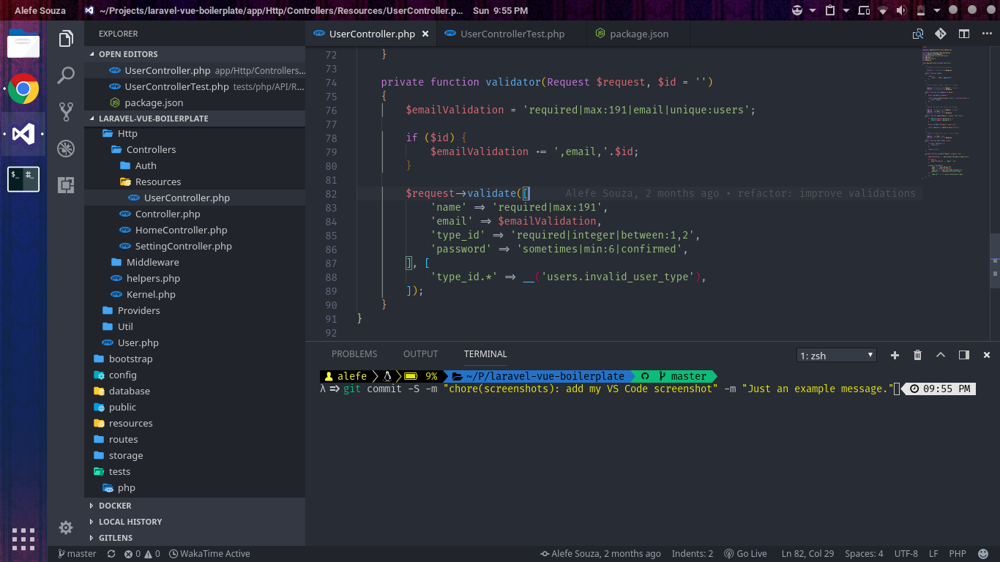

# Alefe Souza Project Guidelines

This repository is just to list the guidelines that I like to use on my personal and professional projects, so I can put a link to it on the CONTRIBUTING.md file when I need to create a solo project without guidelines specified by someone else.

Maybe you check my GitHub and don't find some of them, that's because the code here is a little old and where I work probably I have to use an alternative Git hosting with unlimited private repositories, like GitLab or BitBucket.

- [Knowledge](#knowledge)
- [Git](#git)
- [Front-end Workflow](#frontend-workflow)
- [JavaScript](#javascript)
- [PHP](#php)
- [C#](#csharp)
- [Unit Testing](#unit-testing)
- [Editor](#editor)
- [Study](#study)

## <a name="knowledge"></a> Knowledge

I have good knowledge in JavaScript, PHP, C# and Java, it's the programming languages that I spent more time studying, having more than two years of experience with each of them, if you check my GitHub profile, you can notice that I studied a lot each of them in certain parts of my life, more when I was on highschool.

## <a name="git"></a> Git

### Commits

When I commit on Git, I like to follow the [Angular Commit Message Guidelines](https://github.com/angular/angular/blob/master/CONTRIBUTING.md#commit), which is like:

```
<type>(<scope>): <subject>
<BLANK LINE>
<body>
<BLANK LINE>
<footer>
```

### Branches

When I am working in a solo project, I always create a branch name "development" to work and I merge it to "master" when everything is done.

### Language

I always use English on commit messages and code comments, I also try to create an English version of every app or website I build, so the projects usually have an English and Portuguese version.

### Other

I also like to use the GitLab CI if I need to use GitLab and use Docker on every project.

## <a name="front-workflow"></a> Front-end Workflow

For my front-end workflow I like to use [Gulp](https://github.com/gulpjs/gulp) as my task runner, using it to run [TypeScript](https://github.com/Microsoft/TypeScript) and [Sass](https://github.com/sass/sass) tasks, to minify the generated JavaScript and CSS, and bundle it with the project front-end dependencies.

## <a name="javascript"></a> JavaScript

On JavaScript, I really like to follow the [Airbnb JavaScript Style Guide](https://github.com/airbnb/javascript), I also like to code on other languages based on C, so I don't care about always use the semicolon.

I also prefer to use TypeScript, since I spent some years using Java and C#, I really like types.

Since I really love JavaScript (it was my first programming language, I started to code using it when I was 13), I always try to use the latest features, so it's common to me use a lot of ES6 features, like filter, map, reduce, and even use async await where I can, maybe because I really liked it on C#.

### Angular and AngularJS

For Angular and AngularJS development I like to follow the [John Papa's Angular Style Guide](https://github.com/johnpapa/angular-styleguide/blob/master/a1/README.md).

## <a name="php"></a> PHP

I like to use [PHP Coding Standards Fixer](https://github.com/FriendsOfPHP/PHP-CS-Fixer), setting up my editor to run it on every file save.

## <a name="csharp"></a> C#

On .NET applications like Xamarin, WPF and UWP projects I like to use [Prism](https://github.com/PrismLibrary/Prism) with the MVVM pattern.

## <a name="unit-testing"></a> Unit Testing

I like to unit test almost all my projects, specially my job projects, just to have a good sleeping at night without thinking what if something goes wrong, the tools I like the most to use:

[PHPUnit](https://github.com/sebastianbergmann/phpunit) for PHP projects.

[Mocha](https://github.com/mochajs/mocha) and [Chai](https://github.com/chaijs/chai) for JavaScript projects.

## <a name="editor"></a> Editor

I really like the [Visual Studio Code](https://code.visualstudio.com), to me it's the greatest editor as I program more in JavaScript and PHP, but if I need to program Android apps I will prefer to use Android Studio, or Visual Studio if I need to program some .NET app.

I also like to use [Fira Code](https://github.com/tonsky/FiraCode) as my programming font, and [fish](https://github.com/fish-shell/fish-shell) as my shell.

On VS Code I really like the extensions [GitLens](https://marketplace.visualstudio.com/items?itemName=eamodio.gitlens), [Local History](https://marketplace.visualstudio.com/items?itemName=xyz.local-history), [Vim](https://marketplace.visualstudio.com/items?itemName=vscodevim.vim) and [Material Icon Theme](https://marketplace.visualstudio.com/items?itemName=PKief.material-icon-theme), here is a screenshot of my current VS Code:



## <a name="study"></a> Study

I like to study programming on the [Codecademy website](https://www.codecademy.com) and read official docs of what I'm studying, but I prefer to analyse some open source code and try to understand how everything works, I learned programming in this way.